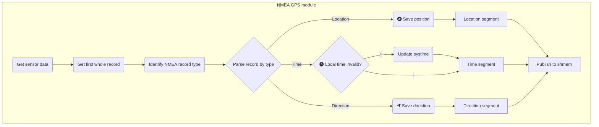

# Logger Architecture

## Data collectors
### NMEA GPS module

```mermaid
flowchart TD;
    subgraph "NMEA GPS module";
        Init(Get sensor data) --> SplitRecord(Get first whole record);
        SplitRecord --> IdentifyRecord(Identify NMEA record type);
        IdentifyRecord --> ParseRecord{Parse record by type};
        ParseRecord -->|Location| LocationSave(fa:fa-compass Save position);
        ParseRecord -->|Time| TimeValidate{fa:fa-clock Local time invalid?};
        ParseRecord -->|Direction| DirectionSave(fa:fa-location-arrow Save direction);
        DirectionSave --> DirectionSegment[Direction segment];
        LocationSave --> LocationSegment[Location segment];
        LocationSegment --> ShMemUpdate[Publish to shmem];
        TimeValidate -->|+| SystimeUpdate(Update systime);
        SystimeUpdate --> TimeSegment[Time segment];
        TimeValidate -->|-| TimeSegment[Time segment];
        TimeSegment --> ShMemUpdate(Publish to shmem);
        DirectionSegment --> ShMemUpdate[Publish to shmem];
    end;
```

